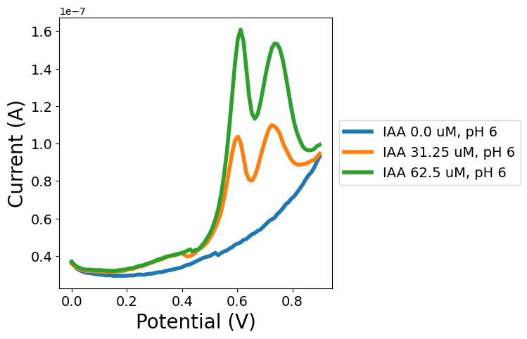

# experiment-to-plot-framework


<!-- WARNING: THIS FILE WAS AUTOGENERATED! DO NOT EDIT! -->

This file will become your README and also the index of your
documentation.

## Usage

### Installation

Install latest from the GitHub
[repository](https://github.com/bxw315-umd/experiment-to-plot-framework):

``` sh
$ pip install git+https://github.com/bxw315-umd/experiment-to-plot-framework.git
```

or from
[conda](https://anaconda.org/bxw315-umd/experiment-to-plot-framework)

``` sh
$ conda install -c bxw315-umd experiment_to_plot_framework
```

or from [pypi](https://pypi.org/project/experiment-to-plot-framework/)

``` sh
$ pip install experiment_to_plot_framework
```

### Documentation

Documentation can be found hosted on this GitHub
[repository](https://github.com/bxw315-umd/experiment-to-plot-framework)’s
[pages](https://bxw315-umd.github.io/experiment-to-plot-framework/).
Additionally you can find package manager specific guidelines on
[conda](https://anaconda.org/bxw315-umd/experiment-to-plot-framework)
and [pypi](https://pypi.org/project/experiment-to-plot-framework/)
respectively.

## How to use

We provide a method for turning a list of potential/current dictionaries
into a plot

Fill me in please! Don’t forget code examples:

``` python
fpaths_to_vars = {'../test_data/iaa_m9_pH/250211_IAA_31.25uM_inM9_pH7_GCE_DPV.csv': (31.25, 7), '../test_data/iaa_m9_pH/250211_Blank_M9_pH5_GCE_DPV.csv': (0, 5), '../test_data/iaa_m9_pH/250211_IAA_62.5uM_inM9_pH6_GCE_DPV.csv': (62.5, 6), '../test_data/iaa_m9_pH/250211_IAA_62.5uM_inM9_pH5_GCE_DPV.csv': (62.5, 5), '../test_data/iaa_m9_pH/250211_IAA_31.25uM_inM9_pH5_GCE_DPV.csv': (31.25, 5), '../test_data/iaa_m9_pH/250211_IAA_31.25uM_inM9_pH6_GCE_DPV.csv': (31.25, 6), '../test_data/iaa_m9_pH/250211_IAA_62.5uM_inM9_pH7_GCE_DPV.csv': (62.5, 7), '../test_data/iaa_m9_pH/250211_Blank_M9_pH7_GCE_DPV.csv': (0, 7), '../test_data/iaa_m9_pH/250211_Blank_M9_pH6_GCE_DPV.csv': (0, 6)}
fpaths_to_vars
```

    {'../test_data/iaa_m9_pH/250211_IAA_31.25uM_inM9_pH7_GCE_DPV.csv': (31.25, 7),
     '../test_data/iaa_m9_pH/250211_Blank_M9_pH5_GCE_DPV.csv': (0, 5),
     '../test_data/iaa_m9_pH/250211_IAA_62.5uM_inM9_pH6_GCE_DPV.csv': (62.5, 6),
     '../test_data/iaa_m9_pH/250211_IAA_62.5uM_inM9_pH5_GCE_DPV.csv': (62.5, 5),
     '../test_data/iaa_m9_pH/250211_IAA_31.25uM_inM9_pH5_GCE_DPV.csv': (31.25, 5),
     '../test_data/iaa_m9_pH/250211_IAA_31.25uM_inM9_pH6_GCE_DPV.csv': (31.25, 6),
     '../test_data/iaa_m9_pH/250211_IAA_62.5uM_inM9_pH7_GCE_DPV.csv': (62.5, 7),
     '../test_data/iaa_m9_pH/250211_Blank_M9_pH7_GCE_DPV.csv': (0, 7),
     '../test_data/iaa_m9_pH/250211_Blank_M9_pH6_GCE_DPV.csv': (0, 6)}

``` python
plot_specs = ExperimentPlotter(fpaths_to_vars, lambda tup: f"IAA {tup[0]} uM, pH {int(tup[1])}").plot_specs
mpl_wrapper(plot_specs[4], xlabel="Potential (V)", ylabel="Current (A)")
```


