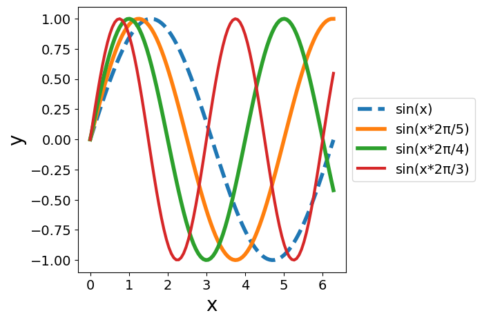

# plot


<!-- WARNING: THIS FILE WAS AUTOGENERATED! DO NOT EDIT! -->

We want to provide a generic plotting function that standardizes
plotting of any data. Therefore, we take in a function that provides a
list of args and kwargs and plots them through matplotlib. For instance,
plotting a sin wave:

------------------------------------------------------------------------

<a
href="https://github.com/bxw315-umd/experiment-to-plot-framework/blob/main/experiment_to_plot_framework/plot.py#L15"
target="_blank" style="float:right; font-size:smaller">source</a>

### mpl_wrapper

>  mpl_wrapper (plot_list:list[tuple[list,dict]], xlabel:str=None,
>                   ylabel:str=None)

*Matplotlib wrapper function. Provides a default plot style given data
to plot. Returns a PIL image containing the plot.*

<table>
<colgroup>
<col style="width: 6%" />
<col style="width: 25%" />
<col style="width: 34%" />
<col style="width: 34%" />
</colgroup>
<thead>
<tr>
<th></th>
<th><strong>Type</strong></th>
<th><strong>Default</strong></th>
<th><strong>Details</strong></th>
</tr>
</thead>
<tbody>
<tr>
<td>plot_list</td>
<td>list</td>
<td></td>
<td>a two-element tuple containing (args, kwargs) to pass to
matplotlib’s <code>plot</code> function.</td>
</tr>
<tr>
<td>xlabel</td>
<td>str</td>
<td>None</td>
<td>X axis label</td>
</tr>
<tr>
<td>ylabel</td>
<td>str</td>
<td>None</td>
<td>Y axis label</td>
</tr>
<tr>
<td><strong>Returns</strong></td>
<td><strong>Image</strong></td>
<td></td>
<td></td>
</tr>
</tbody>
</table>

``` python
x = np.linspace(0, 2*3.14, 100)
y = np.sin(x)
y2 = np.sin(x*2*3.14/5)
y3 = np.sin(x*2*3.14/4)
y4 = np.sin(x*2*3.14/3)

plot_list = [
    ([x, y], {"label": "sin(x)", "linestyle": "dashed"}),
    ([x, y2], {"label": "sin(x*2π/5)"}),
    ([x, y3], {"label": "sin(x*2π/4)"}),
    ([x, y4], {"label": "sin(x*2π/3)", "linewidth": 3}),
]

mpl_wrapper(plot_list, xlabel="x", ylabel="y")
```


