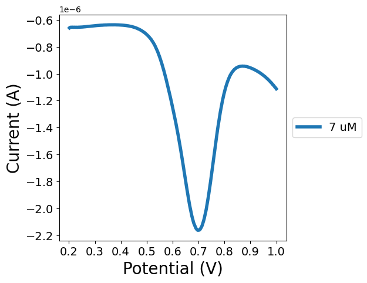

# plot_experiment


<!-- WARNING: THIS FILE WAS AUTOGENERATED! DO NOT EDIT! -->

We can motivate this library by generating plots for a simple
experiment, various levels of IAA concentration. This is a CHI dataset.

``` python
iaa_mnge_root = "../test_data/iaa_mnge"
os.listdir(iaa_mnge_root)
```

    ['IAA_7.8125uM_MNGE_GCE_2_250206.txt',
     'IAA_62.5uM_MNGE_GCE_2_250206.txt',
     'IAA_31.25uM_MNGE_GCE_2_250206.txt',
     'IAA_15.625uM_MNGE_GCE_2_250206.txt']

``` python
fpath = os.path.join(iaa_mnge_root)

with open(os.path.join(fpath, "IAA_7.8125uM_MNGE_GCE_2_250206.txt")) as f:
    contents = f.read()

output_dict = parse_chi_file(contents)
output_dict["numeric_data"] = {k: v[:5] for k, v in output_dict["numeric_data"].items()} # truncate the numeric data just for better display

output_dict
```

    {'memo': {'timestamp': '2025-02-06T17:35:06',
      'technique': 'Differential Pulse Voltammetry',
      'file': 'iaa_7.8125um_mnge_gce_2_250206.bin',
      'instrument_model': 'CHI1040C'},
     'parameters': {'Init E (V)': 0.2,
      'Final E (V)': 1.0,
      'Incr E (V)': 0.002,
      'Amplitude (V)': 0.025,
      'Pulse Width (sec)': 0.05,
      'Sample Width (sec)': 0.0167,
      'Pulse Period (sec)': 0.5,
      'Quiet Time (sec)': 2.0,
      'Sensitivity (A/V)': 1e-06},
     'numeric_data': {'Potential/V': array([0.202, 0.204, 0.206, 0.208, 0.21 ]),
      'Current/A': array([-6.596e-07, -6.557e-07, -6.549e-07, -6.547e-07, -6.545e-07])}}

The objective is to create an interface where the user defines 1. the
files that need to be parsed within a dataset 2. how we map each reading
to an experimental condition

The system automatically figures out which parser to use, based on the
file extension (CHI is .txt and Palmsens is .csv). Then it 1. reads in
the file data according to the specified files 2. maps each measurement
to experimental condition according to the user map 3. calculates all
plots required to cover one variable experimental plotting

Architecturally, we can have the user define a map that takes in a file
path and maps it to a tuple, assuming there’s only one measurement
within the file. This provides all files as well as the mapping to
experimental conditions at the same time **This means files with
multiple measurements are not yet supported.**

``` python
fpath_to_experimental_vars = {
    'IAA_7.8125uM_MNGE_GCE_2_250206.txt': 7.8125,
    'IAA_62.5uM_MNGE_GCE_2_250206.txt': 62.5,
    'IAA_31.25uM_MNGE_GCE_2_250206.txt': 31.25,
    'IAA_15.625uM_MNGE_GCE_2_250206.txt': 15.625,
}
```

Now we just build the class that takes this in

``` python
class ExperimentPlotter:
    def __init__(
        self,
        fpath_to_experimental_vars: dict[str, any or tuple] # mapping from fpath to experimental variables (if there's only one), or a tuple of experimental variables
    ):
        # save experimental vars
        self.fpath_to_experimental_vars = _load_fpath_to_experimental_vars(fpath_to_experimental_vars)

# normal function
assert ExperimentPlotter(fpath_to_experimental_vars).fpath_to_experimental_vars == {'IAA_7.8125uM_MNGE_GCE_2_250206.txt': (7.8125,),
 'IAA_62.5uM_MNGE_GCE_2_250206.txt': (62.5,),
 'IAA_31.25uM_MNGE_GCE_2_250206.txt': (31.25,),
 'IAA_15.625uM_MNGE_GCE_2_250206.txt': (15.625,)}

# error when expt vars isn't a consistent shape
test_fail(lambda: ExperimentPlotter({"a.csv": 1, "b.csv": 2, "c.csv": (1, 2)}))
```

That covers user input. Now, we need to read in the file data. If it’s a
.txt file, we read and parse CHI, asserting that there’s only one
channel’s-worth of information. IF it’s a .csv file, we parse Palmsens,
asserting that there’s only one measurement in the file.

------------------------------------------------------------------------

<a
href="https://github.com/bxw315-umd/experiment-to-plot-framework/blob/main/experiment_to_plot_framework/plot_experiment.py#L66"
target="_blank" style="float:right; font-size:smaller">source</a>

### process_file

>  process_file (fpath)

<table>
<colgroup>
<col style="width: 9%" />
<col style="width: 38%" />
<col style="width: 52%" />
</colgroup>
<thead>
<tr>
<th></th>
<th><strong>Type</strong></th>
<th><strong>Details</strong></th>
</tr>
</thead>
<tbody>
<tr>
<td>fpath</td>
<td></td>
<td>Potentiostat output file (.csv for Palmsens or .txt for CHI)</td>
</tr>
<tr>
<td><strong>Returns</strong></td>
<td><strong>dict</strong></td>
<td><strong>dictionary with <code>"potential</code> (potential in V) and
<code>"current"</code> (current in A)</strong></td>
</tr>
</tbody>
</table>

------------------------------------------------------------------------

<a
href="https://github.com/bxw315-umd/experiment-to-plot-framework/blob/main/experiment_to_plot_framework/plot_experiment.py#L58"
target="_blank" style="float:right; font-size:smaller">source</a>

### palmsens_postprocessor

>  palmsens_postprocessor (parser_output)

------------------------------------------------------------------------

<a
href="https://github.com/bxw315-umd/experiment-to-plot-framework/blob/main/experiment_to_plot_framework/plot_experiment.py#L54"
target="_blank" style="float:right; font-size:smaller">source</a>

### palmsens_read

>  palmsens_read (fpath)

------------------------------------------------------------------------

<a
href="https://github.com/bxw315-umd/experiment-to-plot-framework/blob/main/experiment_to_plot_framework/plot_experiment.py#L47"
target="_blank" style="float:right; font-size:smaller">source</a>

### chi_postprocessor

>  chi_postprocessor (parser_output)

------------------------------------------------------------------------

<a
href="https://github.com/bxw315-umd/experiment-to-plot-framework/blob/main/experiment_to_plot_framework/plot_experiment.py#L43"
target="_blank" style="float:right; font-size:smaller">source</a>

### chi_read

>  chi_read (fpath)

``` python
# testing on CHI
fpath = 'IAA_62.5uM_MNGE_GCE_2_250206.txt'
chi_output = {k: v[:5] for k, v in process_file(os.path.join(iaa_mnge_root, fpath)).items()}
test(chi_output, {'potential': np.array([0.202, 0.204, 0.206, 0.208, 0.21 ]), 'current': np.array([-6.733e-07, -6.715e-07, -6.721e-07, -6.728e-07, -6.733e-07])}, all_equal)

# testing on Palmsens
fpath = "../test_data/iaa_m9_pH/250211_Blank_M9_pH5_GCE_DPV.csv"
ps_output = {k: v[:5] for k, v in process_file(fpath).items()}
test(ps_output, {'potential': np.array([0.        , 0.01020757, 0.02041514, 0.03062271, 0.04083028]), 'current': np.array([2.1246306e-08, 2.0322310e-08, 1.9476714e-08, 1.9017516e-08,
       1.8608716e-08])}, all_equal)
```

So we’ve got the code that reads in the data. We’ve got the map. Now we
need the code that generates the files we need according to experimental
parameters

For instance, if we had concentrations \[0, 5, 10, 15\], then it should
be a single plot with all of them in order \[(0, 5, 10, 15)\]. If we had
two variables, we might have experimental value tuples of \[(0, 5), (5,
5), (10, 5), (0, 6), (5, 6), (10, 6), (0, 7), (5, 7), (10, 7)\] where
each tuple represents (concentration, pH). In other words, it’d be a
grid of concentrations of \[0, 5, 10\] and pHs of \[5, 6, 7\]. Then it’d
would be

``` python
[
    [(0, 5), (5, 5), (10, 5)], # change conc, pH=5
    [(0, 6), (5, 6), (10, 6)], # change conc, pH=6
    [(0, 7), (5, 7), (10, 7)], # change conc, pH=7
    [(0, 5), (0, 6), (0, 7)], # conc=0, change pH
    [(5, 5), (5, 6), (5, 7)], # conc=5, change pH
    [(10, 5), (10, 6), (10, 7)] # conc=10, change pH
]
```

In other words, for each unique variable value within a dimension, keep
that dimension constant and then change the other one. To keep it
simple, we’re only supporting a max of two experimental variables. Three
is uncommon and requires a more generalized algorithm.

So, we’re making an algorithm that takes in all the tuples generated by
mapping. if tuples are only len 1, then just sort them and that’s the
job done. If tuples are len 2, then go through the first dimension’s
unique values and group everything that way. Then do the analogous
operation on the other dimension.

``` python
single_tuple_list = [(3,), (8,), (7,), (1,), (5,)]
experimental_tuples = single_tuple_list

# if it's len 1, then just sort by that single dimension. and there's only one plot
plot_combos = [sorted(set(single_tuple_list), key=lambda x: x[0])] # the set part is to remove duplicates
plot_combos
```

    [[(1,), (3,), (5,), (7,), (8,)]]

``` python
double_tuple_list = [(0, 5), (5, 5), (10, 5), (10, 7), (5, 7), (0, 7), (0, 6), (10, 6), (5, 6)]
experimental_tuples = np.array(double_tuple_list)

# zero-th column is the one we're sorting on. this is just an example to get started. the example covers the first column only
unique_col, other_col = 0, 1
unique_var, var_indices = np.unique(experimental_tuples[:, 0], axis=0, return_inverse=True) # unique values for the first column

current_plot_list = experimental_tuples[var_indices == 0].tolist()
current_plot_list
```

    [[0, 5], [0, 7], [0, 6]]

``` python
# now sort it and make it tuples
sorted([tuple(x) for x in current_plot_list], key=lambda x: x[other_col]) # this is the output we want
```

    [(0, 5), (0, 6), (0, 7)]

``` python
plot_list = []

for i in range(len(unique_var)):
    current_plot_list = experimental_tuples[var_indices == i].tolist()
    current_plot_list = sorted([tuple(x) for x in current_plot_list], key=lambda x: x[other_col])
    plot_list.append(current_plot_list)

plot_list
```

    [[(0, 5), (0, 6), (0, 7)],
     [(5, 5), (5, 6), (5, 7)],
     [(10, 5), (10, 6), (10, 7)]]

we’ve built up all plots in terms of their experimental variables for
the first column (concentration), now we just switch the values for
unique_col and other col to get the plots for the second column

``` python
unique_col, other_col = 1, 0
unique_var, var_indices = np.unique(experimental_tuples[:, unique_col], axis=0, return_inverse=True) # unique values for unique_col

plot_list = []

for i in range(len(unique_var)):
    current_plot_list = experimental_tuples[var_indices == i].tolist()
    current_plot_list = sorted([tuple(x) for x in current_plot_list], key=lambda x: x[other_col])
    plot_list.append(current_plot_list)

plot_list
```

    [[(0, 5), (5, 5), (10, 5)],
     [(0, 6), (5, 6), (10, 6)],
     [(0, 7), (5, 7), (10, 7)]]

and that’s correct for the second column. which means we can just put
everything together and it should work.

------------------------------------------------------------------------

<a
href="https://github.com/bxw315-umd/experiment-to-plot-framework/blob/main/experiment_to_plot_framework/plot_experiment.py#L100"
target="_blank" style="float:right; font-size:smaller">source</a>

### generate_plot_vars

>  generate_plot_vars (var_tuples:list[tuple])

<table>
<colgroup>
<col style="width: 9%" />
<col style="width: 38%" />
<col style="width: 52%" />
</colgroup>
<thead>
<tr>
<th></th>
<th><strong>Type</strong></th>
<th><strong>Details</strong></th>
</tr>
</thead>
<tbody>
<tr>
<td>var_tuples</td>
<td>list</td>
<td>list of experimental values tuples. assumed to all have the same
length</td>
</tr>
</tbody>
</table>

------------------------------------------------------------------------

<a
href="https://github.com/bxw315-umd/experiment-to-plot-framework/blob/main/experiment_to_plot_framework/plot_experiment.py#L77"
target="_blank" style="float:right; font-size:smaller">source</a>

### generate_plot_vars_len_two_helper

>  generate_plot_vars_len_two_helper (var_tuples:list[tuple],
>                                         unique_col:int)

<table>
<colgroup>
<col style="width: 9%" />
<col style="width: 38%" />
<col style="width: 52%" />
</colgroup>
<thead>
<tr>
<th></th>
<th><strong>Type</strong></th>
<th><strong>Details</strong></th>
</tr>
</thead>
<tbody>
<tr>
<td>var_tuples</td>
<td>list</td>
<td>input tuples</td>
</tr>
<tr>
<td>unique_col</td>
<td>int</td>
<td>the index of the column to keep constant. either 0 or 1</td>
</tr>
</tbody>
</table>

``` python
# single variable case
assert generate_plot_vars([(3,), (8,), (7,), (1,), (5,)]) == [[(1,), (3,), (5,), (7,), (8,)]]

# another similar case, floats
assert generate_plot_vars([(1.1,), (1.5,), (3.1,), (0.2,), (1.7,)]) == [[(0.2,), (1.1,), (1.5,), (1.7,), (3.1,)]]

# with a duplicate (expected behavior is to deduplicate)
assert generate_plot_vars([(3,), (3,), (5,)]) == [[(3,), (5,)]]

# double variable case
assert generate_plot_vars([(0, 5), (5, 5), (10, 5), (10, 7), (5, 7), (0, 7), (0, 6), (10, 6), (5, 6)]) == [[(0, 5), (0, 6), (0, 7)],
 [(5, 5), (5, 6), (5, 7)],
 [(10, 5), (10, 6), (10, 7)],
 [(0, 5), (5, 5), (10, 5)],
 [(0, 6), (5, 6), (10, 6)],
 [(0, 7), (5, 7), (10, 7)]]

# different case: conc=0 has an additional pH=8, pH=7 is missing its conc=5. in other words, removed (5, 7) and added (0, 8)
assert generate_plot_vars([(0, 5), (5, 5), (10, 5), (10, 7), (0, 7), (0, 6), (10, 6), (5, 6), (0, 8)]) == [[(0, 5), (0, 6), (0, 7), (0, 8)],
 [(5, 5), (5, 6)],
 [(10, 5), (10, 6), (10, 7)],
 [(0, 5), (5, 5), (10, 5)],
 [(0, 6), (5, 6), (10, 6)],
 [(0, 7), (10, 7)]]
```

fantastic. now that we’ve generated the plots according to vars, we just
need to map vars back to files.

``` python
fpath_to_vars = {'IAA_7.8125uM_MNGE_GCE_2_250206.txt': (7.8125,),
 'IAA_62.5uM_MNGE_GCE_2_250206.txt': (62.5,),
 'IAA_31.25uM_MNGE_GCE_2_250206.txt': (31.25,),
 'IAA_15.625uM_MNGE_GCE_2_250206.txt': (15.625,)}

# because one var can have multiple fpaths, reversal is a tad more complicated than reversing keys and values
unique_vars, vars_inverse = np.unique(list(fpath_to_vars.values()), axis=0, return_inverse=True)
unique_vars, vars_inverse
```

    (array([[ 7.8125],
            [15.625 ],
            [31.25  ],
            [62.5   ]]),
     array([0, 3, 2, 1]))

``` python
fpaths = np.array(list(fpath_to_vars.keys()))
{tuple(var): fpaths[vars_inverse == i].tolist() for i, var in enumerate(unique_vars.tolist())}
```

    {(7.8125,): ['IAA_7.8125uM_MNGE_GCE_2_250206.txt'],
     (15.625,): ['IAA_15.625uM_MNGE_GCE_2_250206.txt'],
     (31.25,): ['IAA_31.25uM_MNGE_GCE_2_250206.txt'],
     (62.5,): ['IAA_62.5uM_MNGE_GCE_2_250206.txt']}

------------------------------------------------------------------------

<a
href="https://github.com/bxw315-umd/experiment-to-plot-framework/blob/main/experiment_to_plot_framework/plot_experiment.py#L116"
target="_blank" style="float:right; font-size:smaller">source</a>

### inverse_fpath_to_vars

>  inverse_fpath_to_vars (fpath_to_vars:dict[str,tuple])

``` python
assert inverse_fpath_to_vars({'IAA_7.8125uM_MNGE_GCE_2_250206.txt': (7.8125,),
 'IAA_62.5uM_MNGE_GCE_2_250206.txt': (62.5,),
 'IAA_31.25uM_MNGE_GCE_2_250206.txt': (31.25,),
 'IAA_15.625uM_MNGE_GCE_2_250206.txt': (15.625,)}) == {(7.8125,): ['IAA_7.8125uM_MNGE_GCE_2_250206.txt'],
 (15.625,): ['IAA_15.625uM_MNGE_GCE_2_250206.txt'],
 (31.25,): ['IAA_31.25uM_MNGE_GCE_2_250206.txt'],
 (62.5,): ['IAA_62.5uM_MNGE_GCE_2_250206.txt']}

assert inverse_fpath_to_vars({"5uM.txt": (5,), "5uM (1).txt": (5,), "10uM": (10,)}) == {(5,): ['5uM.txt', '5uM (1).txt'], (10,): ['10uM']}
```

And finally, we need to work out some specifics on plotting (coloring
when there are multiple lines representing the same vars)

``` python
dev_fpaths_to_vars = {'IAA_7.8125uM_MNGE_GCE_2_250206.txt': (7,), # labeled 7
 'IAA_62.5uM_MNGE_GCE_2_250206.txt': (7,), # also labeled 7, just to test when multiple fpaths map to a single var
 'IAA_31.25uM_MNGE_GCE_2_250206.txt': (31.25,),
 'IAA_15.625uM_MNGE_GCE_2_250206.txt': (15.625,)}
dev_fpaths_to_vars = {os.path.join(iaa_mnge_root, k): v for k, v in dev_fpaths_to_vars.items()}

vars_to_fpaths = inverse_fpath_to_vars(dev_fpaths_to_vars)
vars_to_fpaths
```

    {(7.0,): ['../test_data/iaa_mnge/IAA_7.8125uM_MNGE_GCE_2_250206.txt',
      '../test_data/iaa_mnge/IAA_62.5uM_MNGE_GCE_2_250206.txt'],
     (15.625,): ['../test_data/iaa_mnge/IAA_15.625uM_MNGE_GCE_2_250206.txt'],
     (31.25,): ['../test_data/iaa_mnge/IAA_31.25uM_MNGE_GCE_2_250206.txt']}

``` python
# now we generate the plots we need to make
list_of_plot_vars = list(dev_fpaths_to_vars.values())
to_plot_list = generate_plot_vars(list_of_plot_vars)
to_plot_list
```

    [[(7,), (15.625,), (31.25,)]]

and now we need a new function that takes in a plot specified by vars
(that’s an element of `to_plot_list`) as well as vars_to_fpaths and
generates the plot

``` python
# let's do a single element for now
to_plot = to_plot_list[0]
current_var = to_plot[0]

fpaths_to_plot = vars_to_fpaths[current_var]
fpaths_to_plot
```

    ['../test_data/iaa_mnge/IAA_7.8125uM_MNGE_GCE_2_250206.txt',
     '../test_data/iaa_mnge/IAA_62.5uM_MNGE_GCE_2_250206.txt']

``` python
# time to transform them into plot specs
# first, so colors make sense, we actually need to assign colors to all tuples that will be plotted
to_plot # map these to colors
```

    [(7,), (15.625,), (31.25,)]

``` python
colors = list(mcd.TABLEAU_COLORS) # these are the colors for the traces
colors
```

    ['tab:blue',
     'tab:orange',
     'tab:green',
     'tab:red',
     'tab:purple',
     'tab:brown',
     'tab:pink',
     'tab:gray',
     'tab:olive',
     'tab:cyan']

------------------------------------------------------------------------

<a
href="https://github.com/bxw315-umd/experiment-to-plot-framework/blob/main/experiment_to_plot_framework/plot_experiment.py#L122"
target="_blank" style="float:right; font-size:smaller">source</a>

### assign_colors

>  assign_colors (elements)

``` python
# normal case
assert assign_colors(to_plot) == {(7,): 'tab:blue', (15.625,): 'tab:orange', (31.25,): 'tab:green'}

# more elements than colors should result in cycling
assert assign_colors(list(range(20))) == {0: 'tab:blue',
 1: 'tab:orange',
 2: 'tab:green',
 3: 'tab:red',
 4: 'tab:purple',
 5: 'tab:brown',
 6: 'tab:pink',
 7: 'tab:gray',
 8: 'tab:olive',
 9: 'tab:cyan',
 10: 'tab:blue',
 11: 'tab:orange',
 12: 'tab:green',
 13: 'tab:red',
 14: 'tab:purple',
 15: 'tab:brown',
 16: 'tab:pink',
 17: 'tab:gray',
 18: 'tab:olive',
 19: 'tab:cyan'}
```

now getting back on track

``` python
# load fpaths to vars
dev_fpaths_to_vars = {'IAA_7.8125uM_MNGE_GCE_2_250206.txt': (7,), # labeled 7
 'IAA_62.5uM_MNGE_GCE_2_250206.txt': (7,), # also labeled 7, just to test when multiple fpaths map to a single var
 'IAA_31.25uM_MNGE_GCE_2_250206.txt': (31.25,),
 'IAA_15.625uM_MNGE_GCE_2_250206.txt': (15.625,)}
dev_fpaths_to_vars = {os.path.join(iaa_mnge_root, k): v for k, v in dev_fpaths_to_vars.items()}

fpaths_to_data = {fpath: process_file(fpath) for fpath in dev_fpaths_to_vars} # read the data

vars_to_fpaths = inverse_fpath_to_vars(dev_fpaths_to_vars) # generate inverse


list_of_plot_vars = list(dev_fpaths_to_vars.values())
to_plot_list = generate_plot_vars(list_of_plot_vars)

to_plot = to_plot_list[0]
colors = assign_colors(to_plot) # {(7,): 'tab:blue', (15.625,): 'tab:orange', (31.25,): 'tab:green'}

current_var = to_plot[0]
fpaths_to_plot = vars_to_fpaths[current_var] # ['../test_data/iaa_mnge/IAA_7.8125uM_MNGE_GCE_2_250206.txt', '../test_data/iaa_mnge/IAA_62.5uM_MNGE_GCE_2_250206.txt']
fpath_to_plot = fpaths_to_plot[0] # just the first one

# for a trace (a single line on the graph), i need the potential and current data
current_data_dict = fpaths_to_data[fpath_to_plot]
single_trace = [(current_data_dict["potential"], current_data_dict["current"]), {"color": colors[current_var], "label": f"{current_var[0]} uM"}]

[[arr[:5] for arr in single_trace[0]], single_trace[1]] # show a subset of the data
```

    [[array([0.202, 0.204, 0.206, 0.208, 0.21 ]),
      array([-6.596e-07, -6.557e-07, -6.549e-07, -6.547e-07, -6.545e-07])],
     {'color': 'tab:blue', 'label': '7 uM'}]

``` python
mpl_wrapper([single_trace], xlabel="Potential (V)", ylabel="Current (A)")
```



and then, in general,

``` python
# load fpaths to vars
dev_fpaths_to_vars = {'IAA_7.8125uM_MNGE_GCE_2_250206.txt': (7,), # labeled 7
 'IAA_62.5uM_MNGE_GCE_2_250206.txt': (7,), # also labeled 7, just to test when multiple fpaths map to a single var
 'IAA_31.25uM_MNGE_GCE_2_250206.txt': (31.25,),
 'IAA_15.625uM_MNGE_GCE_2_250206.txt': (15.625,)}
dev_fpaths_to_vars = {os.path.join(iaa_mnge_root, k): v for k, v in dev_fpaths_to_vars.items()}

fpaths_to_data = {fpath: process_file(fpath) for fpath in dev_fpaths_to_vars} # read the data

vars_to_fpaths = inverse_fpath_to_vars(dev_fpaths_to_vars) # generate inverse


list_of_plot_vars = list(dev_fpaths_to_vars.values())
to_plot_list = generate_plot_vars(list_of_plot_vars)

all_plot_specs = []

for to_plot in to_plot_list: # to_plot is something like [(7,), (15.625,), (31.25,)], specifying the vars that need to be plotted
    current_plot_spec = []
    colors = assign_colors(to_plot) # colors for an individual plot

    for current_var in to_plot: # current_var is something like (7,), representing the unique var that's being plotted 
        fpaths_to_plot = vars_to_fpaths[current_var] # all fpaths with that var combination, e.g. ['../test_data/iaa_mnge/IAA_7.8125uM_MNGE_GCE_2_250206.txt', '../test_data/iaa_mnge/IAA_62.5uM_MNGE_GCE_2_250206.txt']

        for fpath_to_plot_i, fpath_to_plot in enumerate(fpaths_to_plot):
            current_data_dict = fpaths_to_data[fpath_to_plot] # collect the data
            kwargs = {"color": colors[current_var]}

            if fpath_to_plot_i == 0: # only for the first one do we label, to avoid redundancy in the legend
                kwargs |= {"label": f"{current_var[0]} uM"} # NOTE that this is custom code! we want the user to provide a labeling scheme
                
            single_trace = [(current_data_dict["potential"], current_data_dict["current"]), kwargs]
            current_plot_spec.append(single_trace)
    
    all_plot_specs.append(current_plot_spec)

[[[arr[:5] for arr in trace[0]], trace[1]] for trace in all_plot_specs[0]]
```

    [[[array([0.202, 0.204, 0.206, 0.208, 0.21 ]),
       array([-6.596e-07, -6.557e-07, -6.549e-07, -6.547e-07, -6.545e-07])],
      {'color': 'tab:blue', 'label': '7 uM'}],
     [[array([0.202, 0.204, 0.206, 0.208, 0.21 ]),
       array([-6.733e-07, -6.715e-07, -6.721e-07, -6.728e-07, -6.733e-07])],
      {'color': 'tab:blue'}],
     [[array([0.202, 0.204, 0.206, 0.208, 0.21 ]),
       array([-6.862e-07, -6.799e-07, -6.774e-07, -6.759e-07, -6.741e-07])],
      {'color': 'tab:orange', 'label': '15.625 uM'}],
     [[array([0.202, 0.204, 0.206, 0.208, 0.21 ]),
       array([-7.070e-07, -7.018e-07, -6.999e-07, -6.986e-07, -6.975e-07])],
      {'color': 'tab:green', 'label': '31.25 uM'}]]

``` python
mpl_wrapper(all_plot_specs[0])
```


Putting everying back into ExperimentPlotter,

------------------------------------------------------------------------

<a
href="https://github.com/bxw315-umd/experiment-to-plot-framework/blob/main/experiment_to_plot_framework/plot_experiment.py#L129"
target="_blank" style="float:right; font-size:smaller">source</a>

### ExperimentPlotter

>  ExperimentPlotter (fpath_to_experimental_vars:dict[str,any],
>                         label_fn:Callable[[tuple],str]=None)

*Initialize self. See help(type(self)) for accurate signature.*

<table>
<colgroup>
<col style="width: 6%" />
<col style="width: 25%" />
<col style="width: 34%" />
<col style="width: 34%" />
</colgroup>
<thead>
<tr>
<th></th>
<th><strong>Type</strong></th>
<th><strong>Default</strong></th>
<th><strong>Details</strong></th>
</tr>
</thead>
<tbody>
<tr>
<td>fpath_to_experimental_vars</td>
<td>dict</td>
<td></td>
<td>mapping from fpath to experimental variables (if there’s only one),
or a tuple of experimental variables</td>
</tr>
<tr>
<td>label_fn</td>
<td>Callable</td>
<td>None</td>
<td>function maps an experimental var tuple to the label that will be
displayed in a plot</td>
</tr>
</tbody>
</table>

``` python
# tests, copied from the first time

# normal operation
fpath_to_experimental_vars = {
    'IAA_7.8125uM_MNGE_GCE_2_250206.txt': 7.8125,
    'IAA_62.5uM_MNGE_GCE_2_250206.txt': 62.5,
    'IAA_31.25uM_MNGE_GCE_2_250206.txt': 31.25,
    'IAA_15.625uM_MNGE_GCE_2_250206.txt': 15.625,
}
fpath_to_experimental_vars = {os.path.join(iaa_mnge_root, k): v for k, v in fpath_to_experimental_vars.items()}

assert ExperimentPlotter(fpath_to_experimental_vars).fpath_to_experimental_vars == {'../test_data/iaa_mnge/IAA_7.8125uM_MNGE_GCE_2_250206.txt': (7.8125,),
 '../test_data/iaa_mnge/IAA_62.5uM_MNGE_GCE_2_250206.txt': (62.5,),
 '../test_data/iaa_mnge/IAA_31.25uM_MNGE_GCE_2_250206.txt': (31.25,),
 '../test_data/iaa_mnge/IAA_15.625uM_MNGE_GCE_2_250206.txt': (15.625,)}

# error when expt vars isn't a consistent shape
test_fail(lambda: ExperimentPlotter(fpath_to_experimental_vars | {"IAA_62.5uM_MNGE_GCE_2_250206.txt": (62.5, 2)}).fpath_to_experimental_vars)

# error with nonexistent files
test_fail(lambda: ExperimentPlotter({"a.csv": 1, "b.csv": 2, "c.csv": (1, 2)}))
```

``` python
fpaths_to_vars = {'IAA_7.8125uM_MNGE_GCE_2_250206.txt': (7,), # labeled 7
 'IAA_62.5uM_MNGE_GCE_2_250206.txt': (7,), # also labeled 7, just to test when multiple fpaths map to a single var
 'IAA_31.25uM_MNGE_GCE_2_250206.txt': (31.25,),
 'IAA_15.625uM_MNGE_GCE_2_250206.txt': (15.625,)}
fpaths_to_vars = {os.path.join(iaa_mnge_root, k): v for k, v in fpaths_to_vars.items()}

plot_specs = ExperimentPlotter(fpaths_to_vars, lambda x: f"{x[0]} uM").plot_specs
test([[[[arr[:5] for arr in trace[0]], trace[1]] for trace in plot_spec] for plot_spec in plot_specs], [[[[np.array([0.202, 0.204, 0.206, 0.208, 0.21 ]),
    np.array([-6.596e-07, -6.557e-07, -6.549e-07, -6.547e-07, -6.545e-07])],
   {'color': 'tab:blue', 'label': '7 uM'}],
  [[np.array([0.202, 0.204, 0.206, 0.208, 0.21 ]),
    np.array([-6.733e-07, -6.715e-07, -6.721e-07, -6.728e-07, -6.733e-07])],
   {'color': 'tab:blue'}],
  [[np.array([0.202, 0.204, 0.206, 0.208, 0.21 ]),
    np.array([-6.862e-07, -6.799e-07, -6.774e-07, -6.759e-07, -6.741e-07])],
   {'color': 'tab:orange', 'label': '15.625 uM'}],
  [[np.array([0.202, 0.204, 0.206, 0.208, 0.21 ]),
    np.array([-7.070e-07, -7.018e-07, -6.999e-07, -6.986e-07, -6.975e-07])],
   {'color': 'tab:green', 'label': '31.25 uM'}]]], all_equal)
mpl_wrapper(plot_specs[0])
```

``` python
fpaths_to_vars = {'IAA_7.8125uM_MNGE_GCE_2_250206.txt': (7.8125,), # correctly labeled
 'IAA_62.5uM_MNGE_GCE_2_250206.txt': (62.5,), # correctly labeled
 'IAA_31.25uM_MNGE_GCE_2_250206.txt': (31.25,),
 'IAA_15.625uM_MNGE_GCE_2_250206.txt': (15.625,)}
fpaths_to_vars = {os.path.join(iaa_mnge_root, k): v for k, v in fpaths_to_vars.items()}

plot_specs = ExperimentPlotter(fpaths_to_vars, lambda x: f"{x[0]} uM IAA").plot_specs
test([[[[arr[:5] for arr in trace[0]], trace[1]] for trace in plot_spec] for plot_spec in plot_specs], [[[[np.array([0.202, 0.204, 0.206, 0.208, 0.21 ]),
    np.array([-6.596e-07, -6.557e-07, -6.549e-07, -6.547e-07, -6.545e-07])],
   {'color': 'tab:blue', 'label': '7.8125 uM IAA'}],
  [[np.array([0.202, 0.204, 0.206, 0.208, 0.21 ]),
    np.array([-6.862e-07, -6.799e-07, -6.774e-07, -6.759e-07, -6.741e-07])],
   {'color': 'tab:orange', 'label': '15.625 uM IAA'}],
  [[np.array([0.202, 0.204, 0.206, 0.208, 0.21 ]),
    np.array([-7.070e-07, -7.018e-07, -6.999e-07, -6.986e-07, -6.975e-07])],
   {'color': 'tab:green', 'label': '31.25 uM IAA'}],
  [[np.array([0.202, 0.204, 0.206, 0.208, 0.21 ]),
    np.array([-6.733e-07, -6.715e-07, -6.721e-07, -6.728e-07, -6.733e-07])],
   {'color': 'tab:red', 'label': '62.5 uM IAA'}]]], all_equal)
mpl_wrapper(plot_specs[0])
```

now to test on palmsens

``` python
iaa_m9_pH_root = "../test_data/iaa_m9_pH"
fpaths = [os.path.join(iaa_m9_pH_root, basepath) for basepath in os.listdir(iaa_m9_pH_root)]
fpaths
```

after getting gpt to assign tuple values,

``` python
fpaths_to_vars = {'../test_data/iaa_m9_pH/250211_IAA_31.25uM_inM9_pH7_GCE_DPV.csv': (31.25, 7), '../test_data/iaa_m9_pH/250211_Blank_M9_pH5_GCE_DPV.csv': (0, 5), '../test_data/iaa_m9_pH/250211_IAA_62.5uM_inM9_pH6_GCE_DPV.csv': (62.5, 6), '../test_data/iaa_m9_pH/250211_IAA_62.5uM_inM9_pH5_GCE_DPV.csv': (62.5, 5), '../test_data/iaa_m9_pH/250211_IAA_31.25uM_inM9_pH5_GCE_DPV.csv': (31.25, 5), '../test_data/iaa_m9_pH/250211_IAA_31.25uM_inM9_pH6_GCE_DPV.csv': (31.25, 6), '../test_data/iaa_m9_pH/250211_IAA_62.5uM_inM9_pH7_GCE_DPV.csv': (62.5, 7), '../test_data/iaa_m9_pH/250211_Blank_M9_pH7_GCE_DPV.csv': (0, 7), '../test_data/iaa_m9_pH/250211_Blank_M9_pH6_GCE_DPV.csv': (0, 6)}
fpaths_to_vars
```

``` python
plot_specs = ExperimentPlotter(fpaths_to_vars, lambda tup: f"IAA {tup[0]} uM, pH {int(tup[1])}").plot_specs
assert len(plot_specs) == 6
len(plot_specs)

mpl_wrapper(plot_specs[2], xlabel="Potential (V)", ylabel="Current (A)")
```

Although the code is technically finished, there are a few things I
don’t like: 1. We still need to pass xlabel and ylabel to mpl_wrapper.
It feels like the plot specs should handle this, as it has the
information of what we’re plotting 2. By having everything in the
initialization, we don’t allow customization of any steps. A minimal
problem right now but for more customization on graph creation, we’ll
want to allow subclassing for customization. And then, generating the
plots can be calculated on-demand by a method rather than at
initialization.
